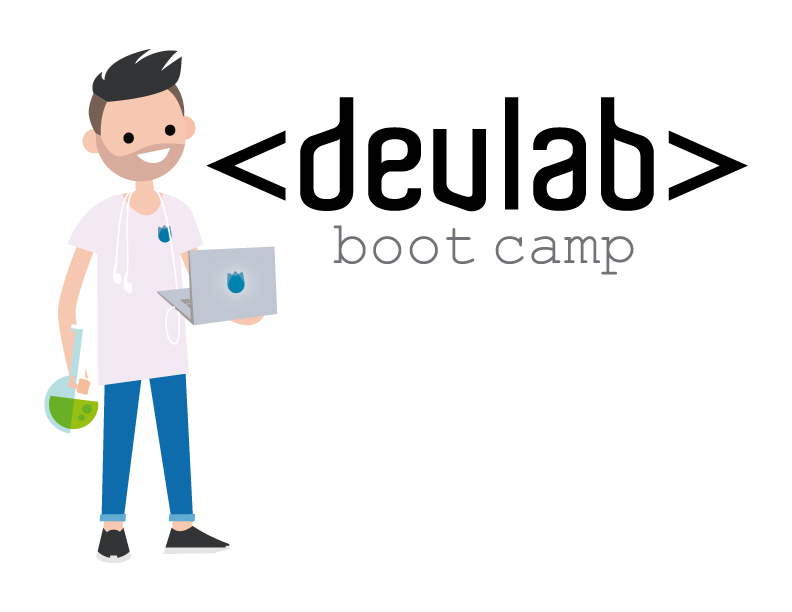

#Node.js + Express + Handlebars

#OOP y herencia en JavaScript

En este tema nos centraremos en aprender cómo JavaScript aborda la programación orientada a objetos.

##Lectura:
1. Un poco de prototype en EMACScript 5.1 http://yehudakatz.com/2011/08/12/understanding-prototypes-in-javascript/
2. ECMAScript 6 y nuevas funcionalidades: http://es6-features.org/.
3. Understanding ECMAScript6
4. Modulos en ES6(EMACScript6) ES6 Modules

##Recomendados
1. AMD, CommonJS, and ES6 Modules Writing Modular JavaScript: https://github.com/lukehoban/es6features

## How To

Logra correr la linea base solo en 3 pasos y comenzar el nivel!

1. Asegurarse de tener instalado [NodeJS](https://nodejs.org/) y [npm](https://www.npmjs.com/).
2. Ingresar en la terminal : npm install.
3. Iniciar proyecto: npm start.
